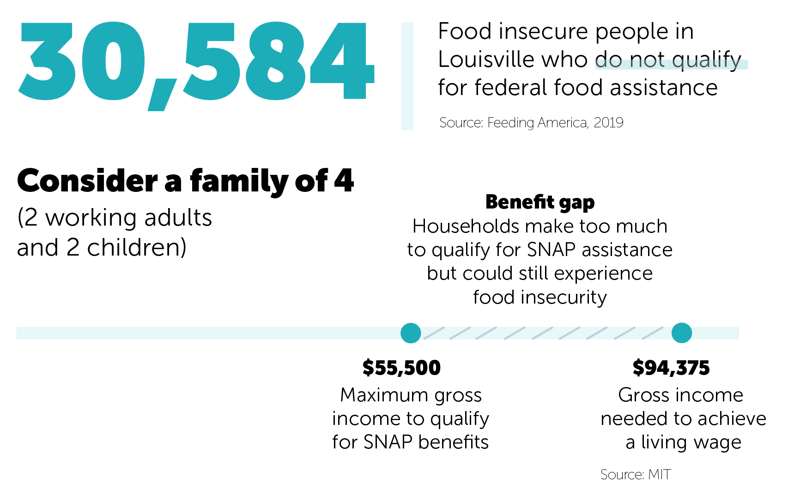

Measuring food insecurity accurately is challenging because it overlaps with a number of difficult-to-measure factors, like poverty, unemployment, median income and disability status. Also, those who are considered food insecure at one point in time might not be food insecure at other times. 

Often, individuals must make difficult (and ongoing) trade off decisions between paying for housing or transportation and buying nutritious food. The typical family of 4 (2 working adults and 2 children) in Louisville needs about **$76,491** each year after taxes (or \$94,375 before taxes) to achieve a living wage. These households spend about 13% of their yearly income on food. A greater share of their income typically goes to child care, transportation and housing. 


Gaining a clear understanding of a community’s food ecosystem is essential to boosting its social and economic health. 

Here are three broad categories to gain a deeper understanding of the food ecosystem in Louisville and its peer cities:

* **Food Insecurity:** the percentage of the population who did not have reliable access to food over the past year
* **Food Access:** the percentage of the population who had some barrier to accessing food over the past year — income constraints, limited vehicle access, etc.
* **Food Environment:** an overview of the various places to buy food in Louisville and its peer cities

> **Key Takeaways:**

* In Louisville and its peer cities, the childhood food insecurity rate is much higher than the overall food insecurity rate. The COVID-19 pandemic further increased the share of children experiencing food insecurity. 
* Among its cohort of peers, Louisville is the worst performer in terms of households that do not have a car and live relatively far from a grocery store (more than 1 mile). Additionally, Louisville appears to be worsening over time, whereas its peers, on average, are improving. 
* Louisville is also the worst performer among its peers in terms of the share of households that receive SNAP benefits and live relatively far from a grocery store (more than 1 mile). It is worsening over time, whereas its peers, on average, are improving. 
* In general, Louisville has more access to healthy foods than its peer cities (with more grocery stores and farmers markets per 100,000 people). It also has fewer convenience stores. 
* Louisville needs about \$46 million annually to meet its current food needs. Its peers need about \$49 million, on average. 
* Nearly 31,000 people in the Louisville area are food insecure and do not qualify for federal food assistance. 

For a closer look at food insecurity in Louisville, check out this [report](https://www.cflouisville.org/community-support/hunger-innovation-fellowship/) from the Community Foundation of Louisville. 

```{r setup, message=FALSE, warning=FALSE}
library(glptools)
library(glpdata)
glp_load_packages(graphs = T)
showtext_auto()
font_add("Museo Sans", "MuseoSans_300.otf")
font_add("Museo Sans 300 Italic", "MuseoSans_300_Italic.otf")
knitr::opts_knit$set(root.dir = rprojroot::find_rstudio_root_file())
knitr::opts_chunk$set(echo = TRUE, warning = FALSE, message = FALSE, 
                      dev.args=list(bg="transparent"), fig.width=15, fig.height=12)
```

# Food Insecurity {.tabset}

The food insecurity metric estimates how much of the population did not have reliable access to food during the past year. Those without reliable access to food tend to disproportionately suffer from diabetes and high blood pressure, among other negative health outcomes, according to Feeding America.

* **How Louisville's Currently Doing:** Nearly 13% of Louisville's population experienced food insecurity last year. That's better than most of Louisville's peers.  
* **How Louisville's Performed Over Time:** For much of the last decade, Louisville had largely been moving in tandem with its peers. Around 2018, it saw a decrease in its food insecurity rate. The city appears to have sustained those decreases during the pandemic, according to Feeding America projections. 

**More Context:** Feeding America uses a fairly detailed process to estimate food insecurity at the county level. First, it examines the relationship between food insecurity and several other factors (poverty, unemployment, median income, disability status, etc) at the *state* level using data from the Current Population Survey. Then, it uses the results of that analysis, together with poverty, unemployment, median income and disability status data at the county level to estimate food insecurity at the *county* level. 

## Ranking
*Note: For 2020 and 2021, Feeding America projected unemployment and poverty data since actual data is not available. Therefore, the food insecurity estimates for 2020 and 2021, which are built on the projected data, could fluctuate in future years.*
```{r food insecurity ranking}
load("intermediate_data/food_security_county.rda")

this_title <- "Food Insecurity"
this_caption <- "\n\nData from Feeding America's annual Map the Meal Gap study, 2021"
this_caption_trend_graphs <- "\n\nData from Feeding America's annual Map the Meal Gap study"

glptools::ranking(
  food_security_county,
  food_insecurity,
  year = 2021,
  peers = "Current",
  order = "Ascending",
  y_title = "Percent experiencing food insecurity",
  plot_title = this_title %p% ", 2021",
  caption_text = this_caption,
  bar_label = TRUE,
  sigfig = 3,
  accuracy = 0.1,
  alternate_text = NULL,
  ranking_colors = TRUE)

```

## Trend
```{r food insecurity trend}
this_title <- "Food Insecurity"
this_caption <- "\n\nData from Feeding America's annual Map the Meal Gap study, 2021"
this_caption_trend_graphs <- "\n\nData from Feeding America's annual Map the Meal Gap study"


glptools::trend(
  food_security_county,
  food_insecurity,
  plot_title = this_title,
  caption_text = this_caption_trend_graphs,
  y_title = "Percent")
```

## Best and Worst Performers
```{r food insecurity best and worst, results='hide'}
this_title <- "Change in Food Insecurity"
this_caption <- "\n\nData from Feeding America's annual Map the Meal Gap study, 2021"
this_caption_trend_graphs <- "\n\nData from Feeding America's annual Map the Meal Gap study"


glptools::trend_maxmin(
  food_security_county,
  food_insecurity,
  zero_start = T,
  rollmean = 3,
  order='Ascending',
  y_title = "Percentage points change",
  plot_title = this_title,
  caption_text = this_caption_trend_graphs)
```

## Neighborhood Map

```{r, out.width = '100%', out.height=500}
insecurity_map <- readxl::read_excel("IN_KY_tracts_zctas_192021.xlsx", sheet = 2, 
                                     col_types = c(rep("text", 5), rep("numeric", 18)))

insecurity_map %<>%
  filter(str_sub(TractID, 1, 5) == "21111") %>%
  transmute(
    tract = TractID,
    food_insecure = percent_food_insecure_2021 * 100)

make_map(insecurity_map, 'food_insecure', 'Food Insecurity')
```

## Metro Council District Map

```{r, out.width = '100%', out.height=500}

crosswalk <- district_tract %>%
  group_by(tract) %>%
  mutate(across(population, ~ . / sum(.)))

pop_df <- glpdata::population_tract %>%
  filter(race == "total", sex == "total", year == 2019) %>%
  select(tract, pop = population)

district_insecurity_map <- insecurity_map %>%
  left_join(crosswalk, by = "tract") %>%
  left_join(pop_df, by = "tract") %>%
  group_by(district) %>%
  summarize(
    dist_pop = sum(population * pop),
    dist_food_insecure = sum(pop * food_insecure * population / 100, na.rm = TRUE),
    insecure_percent = dist_food_insecure / dist_pop * 100)

dist_map <- map_district %>%
  left_join(district_insecurity_map, by = "district")


 labels <- sprintf("%s<br/>%s<br/>%s",
                    "District " %p% district_insecurity_map$district,
                    scales::percent(district_insecurity_map$insecure_percent, scale = 1, accuracy = 0.1) %p% " of residents are food insecure.",
                    scales::comma(district_insecurity_map$dist_food_insecure) %p% " total residents are food insecure.") %>%
    lapply(htmltools::HTML)

 
color_vector <- RColorBrewer::brewer.pal(9, "BuPu")
var_range <- range(dist_map$insecure_percent)
pal <- leaflet::colorNumeric(
  palette = color_vector,
  domain = var_range)

m <- leaflet(dist_map) %>%
  addPolygons(
      color = "#444444", weight = 1, smoothFactor = 0.5, opacity = 1.0, fillOpacity = 0.5,
      fillColor = ~pal(insecure_percent),
      label = labels,
      labelOptions = labelOptions(
        style = list("font-weight" = "normal", "font-family" = "Arial", padding = "3px 8px"),
        textsize = "15px",
        direction = "auto")) %>%
    addLegend(pal = pal, values = var_range, opacity = 0.7, title = "Food Insecurity (%)", position = "bottomright") %>%
  addTiles()

m
```


On the other hand, the food insecurity rate among children is significantly higher. Unlike the overall food insecurity rate, the child food insecurity rate has actually worsened in recent years.

# Child Food Insecurity {.tabset}

Food insecurity among children can be particularly devastating. It can lead to delayed development in young children and increase the risk of asthma, anemia, hyperactivity, anxiety and aggression in school-aged children, according to Feeding America.

* **How Louisville's Currently Doing:** Louisville currently ranks 9th in child food insecurity, with nearly 1 in 5 children experiencing food insecurity during the last year. 
* **How Louisville's Performed Over Time:** Around 2018, the child food insecurity rate rose dramatically in Louisville. Before that, it had been holding steady. Indianapolis is the worst performer of the bunch, with its child food insecurity rate rising 0.2 percentage points since 2014. Louisville is not far behind, having seen only a modest 0.4 percentage point decrease in its rate over the same time period.

## Ranking
*Note: 2020 and 2021 data are projections from Feeding America and could change in subsequent years.*
```{r child food insecurity ranking}
this_title_child <- "Child Food Insecurity"
this_caption_child <- "\n\nData from Feeding America's annual Map the Meal Gap study, 2021"
this_caption_trend_graphs_child <- "\n\nData from Feeding America's annual Map the Meal Gap study"

glptools::ranking(
  food_security_county,
  child_food_insecurity,
  year = 2021,
  peers = "Current",
  order = "Ascending",
  y_title = "Percent of children experiencing food insecurity",
  plot_title = this_title_child %p% ", 2021",
  caption_text = this_caption_child,
  bar_label = TRUE,
  sigfig = 3,
  accuracy = 0.1,
  alternate_text = NULL,
  ranking_colors = TRUE)
```

## Trend
```{r child food insecurity trend}
this_title_child <- "Child Food Insecurity"
this_caption_child <- "\n\nData from Feeding America's annual Map the Meal Gap study, 2021"
this_caption_trend_graphs_child <- "\n\nData from Feeding America's annual Map the Meal Gap study"

glptools::trend(
  food_security_county,
  child_food_insecurity,
  plot_title = this_title_child,
  caption_text = this_caption_trend_graphs_child,
  y_title = "Percent")
```

## Best and Worst Performers
```{r child food insecurity best and worst, results='hide'}
this_title_child <- "Change in Child Food Insecurity"
this_caption_child <- "\n\nData from Feeding America's annual Map the Meal Gap study, 2021"
this_caption_trend_graphs_child <- "\n\nData from Feeding America's annual Map the Meal Gap study"

glptools::trend_maxmin(
  food_security_county,
  child_food_insecurity,
  zero_start = T,
  rollmean = 3,
  order='Ascending',
  y_title = "Percentage points change",
  plot_title = this_title_child,
  caption_text = this_caption_trend_graphs_child)
```

# Food Access 

Here's a closer look at food access in Louisville. When it comes to food deserts, most residents in Louisville have to travel more than a mile to access a grocery store, however that is particularly burdensome for residents who are low-income, who don't have a vehicle, and who are seniors. Since 2011, Louisville has seen the *largest* declines in food access among its peers.

## Limited Access to Grocery Stores and Income Constraints {.tabset}

When looking at the food ecosystem, it's important to consider not only those who live far from a grocery store but also those who live far from a grocery store *and* live on a low income. 

* **How Louisville's Currently Doing:** Louisville currently ranks 8th on this metric, with 68.5% of low-income residents living far from grocery stores.
* **How Louisville's Performed Over Time:** In 2017, the percent of low-income residents living far from a grocery store increased with the closure of two downtown Krogers, and has continued to increase since then. While Louisville ranks in the middle of its peers, it has seen the largest increase in low-income residents living far from a grocery since 2011.

**What's considered far from a grocery store:** Anyone who is more than a one-mile walk or drive is considered far from a grocery store.

### Ranking
```{r food access ranking}
load("intermediate_data/food_access_county.rda")

load("intermediate_data/food desert exports.RData")

this_title <- "Low Income Residents far from Food"
this_subtitle <- "Percent of low-income residents far from grocery stores"
this_caption <- "\n\nData from the USDA's Food Access Research Atlas, 2019"
this_caption_trend_graphs <- "\n\nData from the USDA's Food Access Research Atlas"

glptools::ranking(
  poverty_fd_county,
  pct_food_insecure,
  year = 2020,
  peers = "Current",
  order = "Ascending",
  y_title = "Percent",
  plot_title = this_title %p% ", 2020",
  subtitle = this_subtitle,
  caption_text = this_caption,
  bar_label = TRUE,
  sigfig = 3,
  accuracy = 0.1,
  alternate_text = NULL,
  ranking_colors = TRUE)
```

### Trend
```{r food access trend}
glptools::trend(
  poverty_fd_county,
  pct_food_insecure,
  plot_title = this_title,
  subtitle = this_subtitle,
  caption_text = this_caption_trend_graphs,
  y_title = "Percent")
```

### Best and Worst Performers
```{r food access best and worse, results='hide'}
glptools::trend_maxmin(
  poverty_fd_county,
  pct_food_insecure,
  zero_start = T,
  order='Ascending',
  y_title = "Percentage points change",
  plot_title = "Change in " %p% this_title,
  subtitle = this_subtitle,
  caption_text = this_caption_trend_graphs)
```

### Map
This map shows the percentage of *all* residents who are low-income and far from a grocery. 

```{r limited food access map, out.width = '100%', out.height=500}
load("intermediate_data/kentucky_food_atlas_data.rda")

kentucky_food_atlas_data <- kentucky_food_atlas_data %>%
  na.omit() %>%
  mutate(lalowi1share=as.numeric(lalowi1share))

poverty_fd_map %<>%
  filter(year == 2020, str_sub(tract, 1, 5) == "21111") 

make_map(poverty_fd_map, 'food_desert', 'Low Access and Low Income')
```

## Limited Access to Grocery Stores and Vehicle Access {.tabset}

It becomes significantly more challenging to access nutritious food at a grocery store if a household lives far away and does not have access to a vehicle. These households often must rely on public transportation or shop at stores that are closer to them that potentially have less nutritious food. 

* **How Louisville's Currently Doing:** More than two-thirds of Louisville's households without a vehicle live more than a mile from a grocery store and do not have a vehicle. That puts it in the bottom half of its peer cohort. 
* **How Louisville's Performed Over Time:** Louisville saw a sharp increase in the number of households without vehicles who live far from a grocery in 2017. That makes it the worst performer of its peers.

**More Context:** In Louisville, about 10.4% of households overall do not have access to a vehicle, according to the U.S. Census Bureau's American Community Survey. Statewide, that number is 7%.

### Ranking
```{r food access no vehicle ranking}
load("intermediate_data/food_access_no_vehicle_county.rda")

this_title <- "Households Without a Vehicle far from Food"
this_subtitle <- "Percent of households with no vehicles who are more than 1 mile from a grocery store"
this_caption <- "\n\nData from the USDA's Food Access Research Atlas, 2019"
this_caption_trend_graphs <- "\n\nData from the USDA's Food Access Research Atlas"

glptools::ranking(
  vehicle_fd_county,
  pct_food_insecure,
  year = 2020,
  peers = "Current",
  order = "Ascending",
  y_title = "Percent",
  plot_title = this_title %p% ", 2020",
  subtitle = this_subtitle,
  caption_text = this_caption,
  bar_label = TRUE,
  sigfig = 3,
  accuracy = 0.1,
  alternate_text = NULL,
  ranking_colors = TRUE)


```

### Trend
```{r food access no vehicle trend}
glptools::trend(
  vehicle_fd_county,
  pct_food_insecure,
  plot_title = this_title,
  subtitle = this_subtitle,
  axis_function = scales::percent_format(accuracy = 0.1),
  caption_text = this_caption_trend_graphs,
  y_title = "Percent")
```

### Best and Worst Performers
```{r food access no vehicle best and worse, results='hide'}
glptools::trend_maxmin(
  vehicle_fd_county,
  pct_food_insecure,
  zero_start = T,
  order='Ascending',
  y_title = "Percentage points change",
  plot_title = "Change in " %p% this_title,
  subtitle = this_subtitle,
  caption_text = this_caption_trend_graphs)
```

### Map

This map shows the percentage of *all* residents who lack a vehicle and far from a grocery. 

```{r limited vehicle access map, out.width = '100%', out.height=500}
load("intermediate_data/kentucky_food_atlas_data.rda")

kentucky_food_atlas_data <- kentucky_food_atlas_data %>%
  na.omit() %>%
  mutate(lahunv1share=as.numeric(lahunv1share))

make_map(vehicle_fd_map, 'food_desert', 'Low Access Households without Vehicle')
```

### Bus lines

This map shows areas within a quarter-mile walk of bus stops in teal. Many areas with the highest concentration of food security and low vehicle access are well-covered by TARC routes, though some neighborhoods, particularly in South Louisville, are not. It's important to note that neighborhoods toward the edge of the county that appear very light on the map still contain households with no cars who are far from a grocery and miles from the nearest bus stop.

```{r bus_line, out.width = '100%', out.height=500}
load("intermediate_data/bus_stop_isolines.RData")

bus_stop_isolines %<>%
  sf::st_buffer(50)

make_map(vehicle_fd_map, 'food_desert', 'Low Access Households without Vehicle') %>%
  addPolygons(
    data = bus_stop_isolines,
    color = "#00a9b7FF",
    weight = 2) 

```


## Limited Access to Grocery Stores and SNAP Benefits {.tabset}

These are the households that live far from a grocery store and receive benefits from the Supplemental Nutrition Assistance Program (SNAP).

* **How Louisville's Currently Doing:** Around 70% of Louisville's households that receive SNAP benefits and live more than a mile from a grocery store. That puts the city in the middle of its peers.  
* **How Louisville's Performed Over Time:** Louisville's rate has increased sharply since 2011, and it is the worst performer among its peers.

**More Context:** In Louisville, about 12% of households overall receive food benefits, according to the U.S. Census Bureau's American Community Survey. Statewide, that number is 13%.

### Ranking
```{r food access SNAP ranking}
this_title <- "SNAP Recipients far from Food"
this_subtitle <- "SNAP households that are more than 1 mile from a grocery store"
this_caption <- "\n\nData from the USDA's Food Access Research Atlas, 2019"
this_caption_trend_graphs <- "\n\nData from the USDA's Food Access Research Atlas"

glptools::ranking(
  snap_fd_county,
  pct_food_insecure,
  year = 2020,
  peers = "Current",
  order = "Ascending",
  y_title = "Percent",
  plot_title = this_title %p% ", 2020",
  subtitle = this_subtitle,
  caption_text = this_caption,
  bar_label = TRUE,
  sigfig = 3,
  accuracy = 0.1,
  alternate_text = NULL,
  ranking_colors = TRUE)
```

### Trend
```{r food access SNAP trend}
glptools::trend(
  snap_fd_county,
  pct_food_insecure,
  plot_title = this_title,
  subtitle = this_subtitle,
  caption_text = this_caption_trend_graphs,
  y_title = "Percent")
```

### Best and Worst Performers
```{r food access SNAP best and worse, results='hide'}
glptools::trend_maxmin(
  snap_fd_county,
  pct_food_insecure,
  zero_start = T,
  order='Ascending',
  y_title = "Percentage points change",
  plot_title = "Change in " %p% this_title,
  subtitle = this_subtitle,
  caption_text = this_caption_trend_graphs)
```

### Map
This map shows the percentage of *all* residents who receive SNAP benefits and far from a grocery. 

```{r SNAP map, out.width = '100%', out.height=500}
load("intermediate_data/kentucky_food_atlas_data.rda")

kentucky_food_atlas_data <- kentucky_food_atlas_data %>%
  na.omit() %>%
  mutate(lasnap1share=as.numeric(lasnap1share))

snap_fd_map %<>%
  filter(year == 2020, str_sub(tract, 1, 5) == "21111")

make_map(snap_fd_map, 'food_desert', 'Low Access and SNAP')
```


## Limited Access to Grocery Stores and Seniors {.tabset}

These are the Louisville residents who live far from a grocery store and are seniors (age 65+).

* **How Louisville's Currently Doing:** 75% of Louisville's seniors  live more than a mile from a grocery store. That puts the city in the middle of its peers.  
* **How Louisville's Performed Over Time:** Louisville's rate has increased quicker than its peers over the past five years in which data is available.

### Ranking
```{r food access senior ranking}
this_title <- "Seniors far from Food"
this_subtitle <- "Seniors age 65+ who are more than 1 mile from a grocery store"
this_caption <- "\n\nData from the USDA's Food Access Research Atlas, 2019"
this_caption_trend_graphs <- "\n\nData from the USDA's Food Access Research Atlas"

glptools::ranking(
  age_fd_county,
  pct_food_insecure,
  year = 2020,
  peers = "Current",
  order = "Ascending",
  y_title = "Percent",
  plot_title = this_title %p% ", 2020",
  subtitle = this_subtitle,
  caption_text = this_caption,
  bar_label = TRUE,
  sigfig = 3,
  accuracy = 0.1,
  alternate_text = NULL,
  ranking_colors = TRUE)

# age_stack <- age_fd_county %>%
#   filter(year == 2020) %>%
#   pull_peers(add_info = T) %>%
#   filter(current == 1) %>%
#   arrange(pct_food_insecure) %>%
#   mutate(
#     rank = row_number(),
#     names = paste0(rank, ". ", city))
# 
# age_stack %<>%
#   select(names, rank, city, food_desert, non_food_desert) %>%
#   pivot_longer(food_desert:non_food_desert) %>%
#   arrange(desc(name)) %>%
#   group_by(city) %>%
#   mutate(label_ypos = if_else(name == "food_desert", 
#                               value[name == "food_desert"], 
#                               sum(value)))
# 
# color_values <- c("#800055", "#00A9B7")
# color_names <- c("Food Secure", "Food Insecure")
# 
# age_stack$color <- "Food Insecure"
# age_stack$color[age_stack$name == "non_food_desert"] <- "Food Secure"
# 
# age_stack$alpha = 0.9
# age_stack$alpha[age_stack$city == "Louisville"] <- 1
# 
# # Create numeric labels
# label_text <- age_stack$value %>%
#   scales::percent(accuracy = 0.1, scale = 1, suffix = "%")
# 
# # Set text format, highlight and italicise Louisville text, highlight Louisville bar
# age_stack$textcolor <- "#000000"
# age_stack$textcolor[age_stack$name == "pct_above_frl"] <- "#000000"
# 
# age_stack$textfont <- "Montserrat"
# age_stack$textfont[age_stack$city == "Louisville"] <- "Montserrat Bold"
# 
# label_color_names <- c("white", "black")
# label_color_values <- c("#000000", "#ffffff")
# 
# age_stack$label_color <- "white"
# age_stack$label_color[age_stack$name == "non_food_desert"] <- "black"
# #df$linecolor <- "#ffffff"
# #df$linecolor[df$city == "Louisville"] <- "#00a9b7"
# age_stack$lou <- if_else(age_stack$city == "Louisville", 1, 0)
# age_stack$text_alignment <- 1.1
# # age_stack$text_alignment[age_stack$city %in% "Grand Rapids" &
# #                           age_stack$name == "pct_above_frl"] <- 1.02
# ### PLOT GRAPH
# 
# text_size = 2
# 
# # Initial plot
# p <- ggplot(data = age_stack,
#             aes(x = factor(names, levels = unique(rev(names))),
#                 y = value,
#                 alpha = alpha))
# p <- p + guides(color = FALSE, alpha = FALSE)
# # Add bars
# p <- p +
#   geom_bar(aes(fill = factor(color, levels = color_names, ordered = TRUE)),
#            stat = "identity",
#            size = text_size) +
#   coord_flip() +
#   ggthemes::theme_tufte()
# 
# p <- p + scale_fill_manual(values = color_values, guide = guide_legend(reverse = TRUE)) + 
#   scale_alpha(range = c(0.8, 1))
# 
# text_scale <- 2
# 
# #p <- p + scale_color_manual(values = c("#ffffff", "#00a9b7"))
# # Add features
# title_scale <- min(1, 48 / nchar("Senior Food Security"))
# 
# p <- p + theme(text = element_text(family = "Museo Sans"),
#                plot.title = element_text(size = 14 * title_scale * text_size, hjust = 0.5, margin = margin(b = 10, unit = "pt")),
#                legend.text = element_text(size = 10 * text_scale,
#                                 margin = margin(b = 0.2 * text_scale, t = 0.2 * text_scale, unit = "cm")),
#                axis.text.y = element_text(hjust = 0,
#                                           size = 10 * text_size,
#                                           color = rev(age_stack$textcolor),
#                                           family = rev(age_stack$textfont)),
#                axis.title.y = element_blank(),
#                axis.title.x = element_text(size = 10 * text_size),
#                axis.ticks = element_blank(),
#                axis.text.x = element_blank(),
#                plot.caption = element_text(size = 10 * text_size, lineheight = 0.5),
#                legend.title = element_blank())
# 
# p <- p +
#   labs(caption = "Source: Greater Louisville Project
#                   Data from Feeding America")
# 
# # Add numeric labels to bars based on bar_label parameter
# p <- p + geom_text(aes(label = label_text,
#                        hjust = text_alignment,
#                        color = factor(label_color),
#                        family = textfont,
#                        group = name,
#                        y = label_ypos),
#                    position = "identity",
#                    size = 4.5 * text_size) +
#   scale_colour_manual(values=c("#ffffff", "#000000"))
# 
# # Add vertical line to the left side of the bars based on the h_line parameter
# 
# # Add remaining text
# p <- p + labs(title = "Senior Food Security",
#               y = "Percent") +
#   theme(legend.position = "bottom")
# 
# p <- p +
#   theme(
#     panel.background = element_rect(fill = "transparent", color = NA), # bg of the panel
#     plot.background = element_rect(fill = "transparent", color = NA), # bg of the plot
#     legend.background = element_rect(fill = "transparent", color = "transparent"), # get rid of legend bg
#     legend.box.background = element_rect(fill = "transparent", color = "transparent"), # get rid of legend panel bg
#     legend.key = element_rect(fill = "transparent", colour = NA))
# 
# p
```

### Trend
```{r food access senior trend}
glptools::trend(
  age_fd_county,
  pct_food_insecure,
  plot_title = this_title,
  subtitle = this_subtitle,
  caption_text = this_caption_trend_graphs,
  y_title = "Percent")
```

### Best and Worst Performers
```{r food access senior best and worse, results='hide'}
glptools::trend_maxmin(
  snap_fd_county,
  pct_food_insecure,
  zero_start = T,
  order='Ascending',
  y_title = "Percentage points change",
  plot_title = "Change in " %p% this_title,
  subtitle = this_subtitle,
  caption_text = this_caption_trend_graphs)
```

### Neighborhood Map
This map shows the percentage of *all* residents who are seniors and are far from a grocery. 

```{r age map, out.width = '100%', out.height=500}
age_fd_map %<>%
  filter(year == 2020, str_sub(tract, 1, 5) == "21111")

make_map(age_fd_map, 'food_desert', 'Seniors far from food')
```

### Metro Council District Map

This map shows the percentage of *all* residents who are seniors and are far from a grocery. 

```{r, out.width = '100%', out.height=500}
age_district_map <- age_fd_map %>%
  left_join(crosswalk, by = "tract") %>%
  left_join(pop_df, by = "tract") %>%
  group_by(district) %>%
  summarize(
    dist_pop = sum(population * pop),
    dist_food_insecure = sum(pop * food_desert * population / 100, na.rm = TRUE),
    insecure_percent = dist_food_insecure / dist_pop * 100)

dist_map <- map_district %>%
  left_join(age_district_map, by = "district")


 labels <- sprintf("%s<br/>%s",
                    "District " %p% dist_map$district,
                    scales::percent(dist_map$insecure_percent, scale = 1, accuracy = 0.1) %p% " of residents are seniors far from a grocery.") %>%
    lapply(htmltools::HTML)

 
color_vector <- RColorBrewer::brewer.pal(9, "BuPu")
var_range <- range(dist_map$insecure_percent)
pal <- leaflet::colorNumeric(
  palette = color_vector,
  domain = var_range)

m <- leaflet(dist_map) %>%
  addPolygons(
      color = "#444444", weight = 1, smoothFactor = 0.5, opacity = 1.0, fillOpacity = 0.5,
      fillColor = ~pal(insecure_percent),
      label = labels,
      labelOptions = labelOptions(
        style = list("font-weight" = "normal", "font-family" = "Arial", padding = "3px 8px"),
        textsize = "15px",
        direction = "auto")) %>%
    addLegend(pal = pal, values = var_range, opacity = 0.7, title = "Food Insecurity (%)", position = "bottomright") %>%
  addTiles()

m
```

# Food Environment

What does the food environment look like in Louisville? Here's a map of large grocery stores in Louisvilla and a breakdown of the number of grocery stores, supercenters, warehouse club stores, convenience stores, fast food restaurants and farmers markets per 100,000 people.

## Grocery Map

This map shows areas within a one-mile walk or drive of large grocery stores in Louisville. Most grocery stores are categorized as superstores because they sell a variety of consumer in addition to food, like clothes, cleaning supplies, and other household goods. Supermarkets are very large groceries, typically with 10 or more checkout lanes, while large grocery stores are other large food providers.

```{r, out.width = '100%', out.height = '600px'}
load("intermediate_data/Louisville map.RData")

library(viridis)

pal <- leaflet::colorFactor(
  palette = viridis(3),
  domain = c("Large Grocery Store", "Super Store", "Supermarket"))

lou_food_map %<>%
  filter(!is.na(type))

leaflet(lou_food_map, width = "100%") %>%
  addTiles() %>%
  addPolygons(data = filter(map_county, FIPS == "21111"),
            color = "black",
            opacity = 1,
            weight = 2,
            fillOpacity = 0) %>%
  addPolygons(color = ~pal(type),
                   opacity = 0.7,
                   weight = 2,                   
                   label = ~name,
                   labelOptions = labelOptions(style = 
                    list("font-weight" = "normal", 
                         "font-family" = "Montserrat", 
                         padding = "3px 8px"),
                    textsize = "15px",
                    direction = "auto")) %>%
 addLegend(title = "Store Type", labels = c("Large Grocery Store", "Super Store", "Supermarket"), colors = viridis(3))

```

## Food Sources {.tabset}

The number of grocery stores, convenience stores and fast food restaurants has remained relatively constant since 2009. Even so, Louisville currently has more grocery stores per 100,000 people than its peer cities, on average. It also has significantly fewer convenience stores than its peers, on average. Louisville has slightly more supercenters and warehouse clubs than its peers.

**More Context:** The USDA defines each of these establishments precisely. Here are the definitions:

* Grocery stores are stores that sell canned and frozen foods, fresh fruits and vegetables and fresh meats. Deli-type stores are also included. Convenience stores, supercenters and warehouse club stores are not included.
* Supercenters and warehouse club stores sell groceries and general merchandise, like clothes, furniture and appliances.
* Convenience stores — also known as food marts — primarily sell milk, bread, soda and snacks. 
* Fast food restaurants are places in which customers order their food and pay before eating. Customers can consume the food at the store, take it out or have it delivered. Fast food restaurants can also sell alcohol. 
* Farmers markets are retail outlets with two or more vendors who sell agricultural products directly to consumers. (At least 51 percent of the retail sales must be direct to consumers).   


### Grocery, Convenience and Fast Food 
```{r food environment trend}

load("intermediate_data/food_environment_county.rda")

food_environment_county <- food_environment_county %>%
  filter(year!=2007)

this_title <- "Louisville Food Sources"
this_subtitle <- "Per 100,000 people"
this_caption_trend_graphs <- "\n\nData from the USDA's Food Environment Atlas"

glptools::trend(
  food_environment_county, c(grocery_stores_per_100000, convenience_stores_per_100000, fast_food_per_100000),
  cat = c("Grocery Stores" = "grocery_stores_per_100000", "Convenience Stores" = "convenience_stores_per_100000", "Fast Food Restaurants" = "fast_food_per_100000"),
  pctiles=F,
  plot_title = this_title,
  subtitle = this_subtitle,
  caption_text = this_caption_trend_graphs,
  y_title = "Number of Stores")
```

### Supercenters and Warehouse Clubs
```{r supercenters trend}

load("intermediate_data/food_environment_county.rda")

food_environment_county <- food_environment_county %>%
  filter(year!=2007)

this_title <- "Supercenters and Warehouse Clubs"
this_subtitle <- "Per 100,000 people"
this_caption_trend_graphs <- "\n\nData from the USDA's Food Environment Atlas"

glptools::trend(
  food_environment_county,
  supercenters_per_100000,
  pctiles=F,
  plot_title = this_title,
  subtitle = this_subtitle,
  caption_text = this_caption_trend_graphs,
  y_title = "Number of Locations")
```

### Farmers Markets 
```{r farmers markets trend}

this_title <- "Farmers Markets"
this_subtitle <- "Per 100,000 people"
this_caption_trend_graphs <- "\n\nData from the USDA's Food Environment Atlas"

glptools::trend(
  food_environment_county,
  farmers_markets_per_100000,
  pctiles=F,
  plot_title = this_title,
  subtitle = this_subtitle,
  caption_text = this_caption_trend_graphs,
  y_title = "Number of Locations")
```

### Grocery Ranking
```{r grocery ranking}

glptools::ranking(
  food_environment_county,
  grocery_stores_per_100000,
  year = 2016,
  peers = "Current",
  order = "Descending",
  y_title = "Grocery stores per 100,000 people",
  plot_title = "Grocery Stores, 2016",
  caption_text = "\n\nData from the USDA's Food Environment Atlas, 2016",
  bar_label = TRUE,
  sigfig = 3,
  accuracy = 0.1,
  alternate_text = NULL,
  ranking_colors = FALSE)
```

### Convenience Ranking
```{r convenience ranking}

glptools::ranking(
  food_environment_county,
  convenience_stores_per_100000,
  year = 2016,
  peers = "Current",
  order = "Ascending",
  y_title = "Convenience stores per 100,000 people",
  plot_title = "Convenience Stores, 2016",
  caption_text = "\n\nData from the USDA's Food Environment Atlas, 2016",
  bar_label = TRUE,
  sigfig = 3,
  accuracy = 0.1,
  alternate_text = NULL,
  ranking_colors = FALSE)
```

### Fast Food Ranking
```{r fast food ranking}

glptools::ranking(
  food_environment_county,
  fast_food_per_100000,
  year = 2016,
  peers = "Current",
  order = "Ascending",
  y_title = "Fast food restaurants per 100,000 people",
  plot_title = "Fast Food Restaurants, 2016",
  caption_text = "\n\nData from the USDA's Food Environment Atlas, 2016",
  bar_label = TRUE,
  sigfig = 3,
  accuracy = 0.1,
  alternate_text = NULL,
  ranking_colors = FALSE)
```

### Supercenters and Warehouse Clubs Ranking
```{r supercenter ranking}

glptools::ranking(
  food_environment_county,
  supercenters_per_100000,
  year = 2016,
  peers = "Current",
  order = "Descending",
  y_title = "Supercenters/warehouse clubs per 100,000 people",
  plot_title = "Supercenters and Warehouses, 2016",
  caption_text = "\n\nData from the USDA's Food Environment Atlas, 2016",
  bar_label = TRUE,
  sigfig = 3,
  accuracy = 0.1,
  alternate_text = NULL,
  ranking_colors = FALSE)
```

### Farmers Market Ranking
```{r farmers market ranking}

glptools::ranking(
  food_environment_county,
  farmers_markets_per_100000,
  year = 2018,
  peers = "Current",
  order = "Descending",
  y_title = "Farmers markets per 100,000 people",
  plot_title = "Farmers Markets, 2018",
  caption_text = "\n\nData from the USDA's Food Environment Atlas, 2018",
  bar_label = TRUE,
  sigfig = 3,
  accuracy = 0.1,
  alternate_text = NULL,
  ranking_colors = FALSE)
```

# Tackling Food Insecurity

Currently, Louisville needs about \$46 million annually to meet the needs of its food insecure population, according to estimates from Feeding America. That's lower than the peer average of about \$49 million.

The budget shortfall in Louisville and its peer cities has decreased over time. It's important to note, however, that the percentage of people experiencing food insecurity has also decreased over this time. 

> **Bridging the Household Budget Gap:**

* Bridging this $46 million gap in Louisville (and similar gaps in other cities) is tricky. Government programs like the Supplemental Nutrition Assistance Program (SNAP), WIC program and school meal programs help some — but far from all — of the food insecure. 
* In Louisville, households can only make up to 200% of the federal poverty level to qualify for federal food assistance. In 2019, Feeding America estimated that 34.1% of the food insecure population in Jefferson County live in households that make *more than* 200% of the federal poverty level and therefore do not qualify for federal food assistance. That means that about 30,584 people in the Louisville area are food insecure and do not qualify for federal food assistance. At least 12,200 of those people are children. Many depend on the charitable sector or other non-governmental sources to meet their food needs.



```{r budget shortfall standardized, fig.width=18}

load("intermediate_data/standardized_budget_shortfall.rda")

this_title <- "Food Insecurity Budget Shortfall"
this_subtitle <- "The amount needed annually to address food insecurity"
this_caption_trend_graphs <- "\n\nData from Feeding America's annual Map the Meal Gap study"

glptools::trend(
  standardized_budget_shortfall, 
  budget_shortfall_standardized,
  pctiles=F,
  plot_title = this_title,
  subtitle = this_subtitle,
  caption_text = this_caption_trend_graphs,
  axis_function  = dollar_format(scale = .000001, suffix = "M", accuracy = 10),
  label_function = dollar_format(scale = .000001, suffix = "M", accuracy = .1),
  y_title = "Dollars")
```

*Note: The budget shortfall in Louisville's peer cities is standardized to Louisville's total food insecure population in each year.*

> **Learn More:**
What are policy makers doing to address food insecurity? Check out this [public policy brief](https://www.cflouisville.org/wp-content/uploads/2018/11/CITATIONS_Public_Policy_Landscape_Louisville_9_27_2018.pdf) on the food access landscape in Louisville from the Community Foundation of Louisville.

